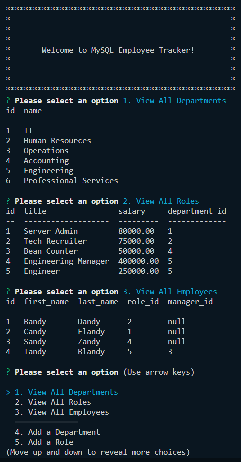

# sql-employee-tracker [](https://opensource.org/licenses/MIT)

## Description

This challenge was to build a command-line application from scratch to manage a company's employee database, using Node.js, Inquirer, and MySQL.

### User Story
```
AS A business owner
I WANT to be able to view and manage the departments, roles, and employees in my company
SO THAT I can organize and plan my business
```

### Acceptance Criteria
```
GIVEN a command-line application that accepts user input

WHEN I start the application
THEN I am presented with the following options: view all departments, view all roles, view all employees, add a department, add a role, add an employee, and update an employee role

WHEN I choose to view all departments
THEN I am presented with a formatted table showing department names and department ids

WHEN I choose to view all roles
THEN I am presented with the job title, role id, the department that role belongs to, and the salary for that role

WHEN I choose to view all employees
THEN I am presented with a formatted table showing employee data, including employee ids, first names, last names, job titles, departments, salaries, and managers that the employees report to

WHEN I choose to add a department
THEN I am prompted to enter the name of the department and that department is added to the database

WHEN I choose to add a role
THEN I am prompted to enter the name, salary, and department for the role and that role is added to the database

WHEN I choose to add an employee
THEN I am prompted to enter the employee’s first name, last name, role, and manager, and that employee is added to the database

WHEN I choose to update an employee role
THEN I am prompted to select an employee to update and their new role and this information is updated in the database
```

## Table of Contents

- [Installation](#installation)
- [Usage](#usage)
- [License](#license)
- [Credits](#credits)
- [Questions](#questions)

## Installation

To install download root files from github repository and run `npm install`.  Connect to your MySQL database and run `SOURCE schema.sql` to implement DB schema, then `SOURCE seeds.sql` to seed tables with sample data.

## Usage

Visit the above URL, then click "Get Started" to see notes.  Users can view old notes by clicking them, or add a new note by clicking the '+' sign in the upper right hand corner, followed by the save icon after entering a note title and text.  Users can also delete notes by clicking the red trashcan associated with the note.

### Screenshot of database schema


### Screenshot of terminal application


## License

MIT License - Please refer to the LICENSE in the repo.

## Credits

N/A

## Questions

You can view my Github @ https://www.github.com/maximusDecimalusMeridius  
OR  
Email me with questions @ [andygg_dev@yahoo.com](mailto:andygg_dev@yahoo.com?subject=Question%20About%20mysql-employee-tracker%20App)
    